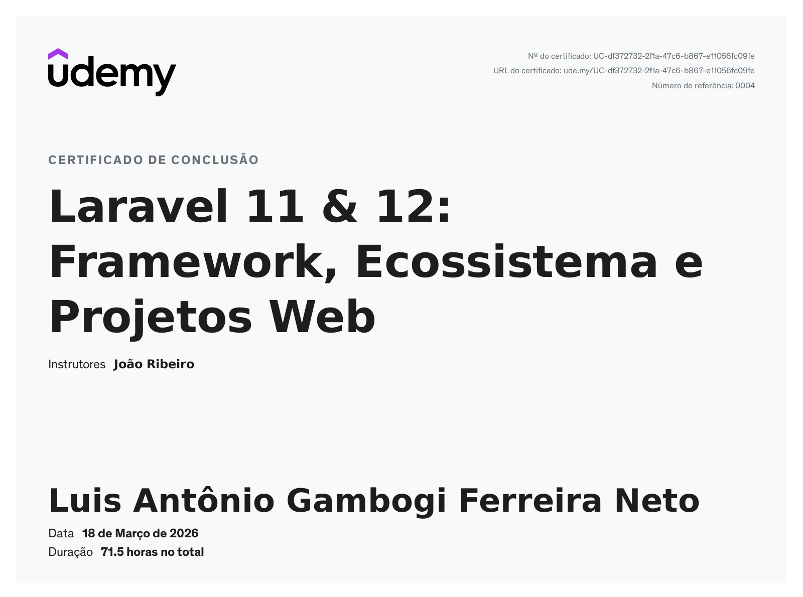

# 🚀 Laravel 11 & 12 - Curso Completo (João Ribeiro - Udemy)

Este repositório contém meus estudos, exemplos e projetos desenvolvidos durante o curso de Laravel 11 e 12 do professor João Ribeiro na Udemy.

O foco foi aprender desde os fundamentos até a construção de aplicações completas com autenticação, APIs e deploy.

## 📚 Conteúdos abordados

- [x] Criação de projetos com Laravel Herd  
- [x] Arquitetura MVC (Model, View, Controller)  
- [x] Rotas, Controllers e Middlewares  
- [x] Blade Template Engine (Components e Layouts)  
- [x] Banco de dados (Migrations, Factories, Seeders)  
- [x] Query Builder  
- [x] Eloquent ORM  
- [x] Autenticação com Breeze  
- [x] Autenticação com Fortify  
- [x] Sistema de autenticação personalizado  
- [x] Autorização com Gates e Policies  
- [x] Projeto completo (Sistema de RH)  
- [x] Laravel Livewire  
- [x] Laravel FileSystem
- [x] API REST com Sanctum  
- [x] Deploy em hospedagem compartilhada
- [x] Testes funcionais e unitários com PestPHP
- [x] Integração com Stripe (Cashier)  
- [x] Starter Kits (Laravel 12)

## 💼 Projeto em destaque

Sistema de Gestão de Recursos Humanos com:

- Autenticação completa
- Controle de usuários
- Permissões e autorização
- CRUD completo
- Integração com banco de dados

## 🛠️ Tecnologias

- PHP
- Laravel 11/12
- PostgreSQL
- Blade
- Livewire
- Stripe API
- Insomnia

## 🎓 Sobre o curso

- Plataforma: Udemy  
- Instrutor: João Ribeiro  
- Carga horária: 72 horas

## 🔗 Link do curso

[Laravel 11 & 12: Framework, Ecossistema e Projetos Web](https://www.udemy.com/course/laravel-11-framework-ecossistema-e-projetos-web/)

## 📜 Certificado

[Ver certificado](https://www.udemy.com/certificate/UC-df372732-2f1a-47c6-b867-e11056fc09fe/)

